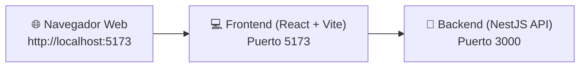

# 🏋️‍♂️ Weightcontrol

Sistema integral de control y seguimiento de peso y hábitos saludables. Este repositorio contiene tanto la API del backend (NestJS) como la aplicación cliente frontend (React + Vite).

---

## 📋 Tabla de Contenidos
1. [Requisitos Previos y Enlaces de Descarga](#-requisitos-previos-y-enlaces-de-descarga)
2. [Estructura del Proyecto](#-estructura-del-proyecto)
3. [Tecnologías Utilizadas](#️-tecnologías-utilizadas)
4. [Guía Paso a Paso para Iniciar el Proyecto](#-guía-paso-a-paso-para-iniciar-el-proyecto)
   - [Paso 1: Clonar el Repositorio](#paso-1-clonar-el-repositorio)
   - [Paso 2: Configurar y Ejecutar el Backend](#paso-2-configurar-y-ejecutar-el-backend)
   - [Paso 3: Configurar y Ejecutar el Frontend](#paso-3-configurar-y-ejecutar-el-frontend)
5. [Asistente de Commits Automáticos](#-asistente-de-commits-automáticos-commitps1-y-commitsh)
6. [Guía para el Grupo de Trabajo (Colaboradores)](#-guía-para-el-grupo-de-trabajo-colaboradores)
7. [Solución de Problemas Frecuentes (FAQ / Troubleshooting)](#-solución-de-problemas-frecuentes-faq--troubleshooting)

---

## 📥 Requisitos Previos y Enlaces de Descarga

Si es la primera vez que vas a trabajar en el proyecto y no tienes instaladas las herramientas, descárgalas desde sus sitios oficiales:

| Herramienta | Versión Recomendada | Enlace Oficial de Descarga | ¿Cómo verificar si ya lo tienes? |
| :--- | :--- | :--- | :--- |
| **Node.js** (incluye npm) | **v18 o superior** (LTS recomendada) | 🔗 [Descargar Node.js](https://nodejs.org/en/download) | `node -v` y `npm -v` |
| **Git** | Última versión disponible | 🔗 [Descargar Git para Windows/Mac/Linux](https://git-scm.com/downloads) | `git --version` |
| **Visual Studio Code** *(Opcional)* | Editor recomendado | 🔗 [Descargar VS Code](https://code.visualstudio.com/Download) | `code -v` |

> ⚠️ **Importante durante la instalación en Windows**:
> - Al instalar **Node.js**, asegúrate de dejar marcada la casilla *"Add to PATH"*.
> - Al instalar **Git**, asegúrate de seleccionar *"Git from the command line and also from 3rd-party software"*.
> - Al finalizar las instalaciones, **reinicia tu terminal o VS Code** para que reconozca los comandos.

---

## 📁 Estructura del Proyecto

```text
Weightcontrol/
├── backend/                  # API REST construida con NestJS
│   ├── src/                  # Módulos, controladores, servicios y lógica de negocio
│   │   ├── app.controller.ts # Controlador principal
│   │   ├── app.service.ts    # Servicios principales
│   │   └── main.ts           # Punto de entrada con Logger de puerto integrado
│   ├── test/                 # Pruebas unitarias y End-to-End (e2e)
│   ├── package.json          # Dependencias y scripts del backend
│   └── tsconfig.json         # Configuración de TypeScript
├── frontend/                 # Aplicación web interactiva con React + Vite
│   ├── src/                  # Componentes, vistas y lógica de la interfaz
│   ├── index.html            # Plantilla HTML principal
│   ├── package.json          # Dependencias y scripts del frontend
│   └── vite.config.ts        # Configuración de Vite
├── .gitignore                # Reglas de exclusión para Git (ignora node_modules, dist, .env)
├── commit.ps1                # Asistente de commits para PowerShell (Windows)
├── commit.sh                 # Asistente de commits para Git Bash / Linux / macOS
└── README.md                 # Documentación completa del proyecto
```

---

## 🛠️ Tecnologías Utilizadas

| Módulo | Tecnologías Principales |
| :--- | :--- |
| **Backend (API)** | [NestJS](https://nestjs.com/) v12, [TypeScript](https://www.typescriptlang.org/), [Vitest](https://vitest.dev/), [Supertest](https://github.com/ladjs/supertest), [RxJS](https://rxjs.dev/) |
| **Frontend (UI)** | [React](https://react.dev/) v19, [Vite](https://vitejs.dev/) v8, [TypeScript](https://www.typescriptlang.org/), [ESLint](https://eslint.org/) |
| **Entorno de Ejecución** | [Node.js](https://nodejs.org/) v18+ (Testeado y compatible con Node v22) |

---

## 🚀 Guía Paso a Paso para Iniciar el Proyecto

Para levantar el proyecto completo necesitas tener corriendo **dos terminales simultáneas**: una para el Backend y otra para el Frontend.



---

### Paso 1: Clonar el Repositorio

Abre tu terminal preferida (PowerShell, CMD o Git Bash) y clona el proyecto:

```bash
git clone https://github.com/Juan2007-sys/Weightcontrol.git
cd Weightcontrol
```

---

### Paso 2: Configurar y Ejecutar el Backend

El backend proporciona la API REST y la lógica del servidor.

```bash
# 1. Entrar a la carpeta backend
cd backend

# 2. Instalar las dependencias
npm install --legacy-peer-deps

# 3. Iniciar el servidor en modo desarrollo
npm run start:dev
```

> 🌐 **Resultado esperado**: Verás en la consola el logger de NestJS indicando:
> ```text
> [Nest] LOG [Bootstrap] 🚀 Application is running on: http://localhost:3000
> ```

#### Comandos del Backend:
| Comando | Función |
| :--- | :--- |
| `npm run start:dev` | Inicia el backend con recarga automática al guardar cambios |
| `npm run build` | Compila TypeScript a código JavaScript optimizado en `dist/` |
| `npm run start:prod` | Ejecuta la versión compilada de producción |
| `npm run test` | Ejecuta las pruebas unitarias con Vitest |
| `npm run test:e2e` | Ejecuta las pruebas End-to-End |

---

### Paso 3: Configurar y Ejecutar el Frontend

Abre una **segunda terminal** en la raíz del proyecto `Weightcontrol`:

```bash
# 1. Entrar a la carpeta frontend
cd frontend

# 2. Instalar las dependencias
npm install

# 3. Iniciar el servidor de desarrollo de Vite
npm run dev
```

> 💻 **Resultado esperado**: La terminal te mostrará la URL local:
> ```text
> VITE v8.x.x  ready in 200 ms
> ➜  Local:   http://localhost:5173/
> ```
> Abre tu navegador en **[http://localhost:5173](http://localhost:5173)** para interactuar con la aplicación.

#### Comandos del Frontend:
| Comando | Función |
| :--- | :--- |
| `npm run dev` | Inicia el servidor de desarrollo local con Hot Module Replacement (HMR) |
| `npm run build` | Compila y optimiza la aplicación para producción en `frontend/dist/` |
| `npm run preview` | Previsualiza localmente el build de producción |
| `npm run lint` | Ejecuta el análisis estático de código con ESLint |

---

## ⚡ Asistente de Commits Automáticos (`commit.ps1` y `commit.sh`)

Para estandarizar los commits del equipo según la convención **Conventional Commits** y evitar comandos largos de Git, dispones de scripts automatizados:

### 🌟 En Windows (PowerShell) - Recomendado:
```powershell
# Modo guiado interactivo (te hace preguntas paso a paso):
.\commit.ps1

# Modo rápido con mensaje directo:
.\commit.ps1 "feat(backend): agregar modulo de usuarios"
```

### 🐧 En Git Bash / Linux / macOS:
```bash
# Modo guiado:
./commit.sh

# Modo rápido:
./commit.sh "fix(frontend): corregir botón de guardado"
```

### ¿Qué hace el asistente?
1. Muestra el autor configurado y la rama actual (`main`, `feature/...`, etc.).
2. Identifica los archivos que modificaste (`git status -s`).
3. Agrega los cambios automáticamente al stage (`git add .`).
4. Te ayuda a clasificar el tipo de commit:
   - `feat`: Nueva funcionalidad.
   - `fix`: Corrección de error.
   - `docs`: Documentación o cambios en README.
   - `style`: Formateo, espaciados o CSS.
   - `refactor`: Mejora de código sin alterar funcionalidad.
   - `test`: Pruebas unitarias o e2e.
   - `chore`: Dependencias, configs o mantenimiento.
5. Permite ingresar el módulo/alcance opcional (ej. `backend`, `frontend`, `auth`).
6. Genera el commit estandarizado: `tipo(alcance): descripción`.
7. Te pregunta si deseas subirlo inmediatamente a GitHub (`git push`).

---

## 👥 Guía para el Grupo de Trabajo (Colaboradores)

Para que varios integrantes puedan colaborar en este repositorio sin conflictos:

### 1. El Administrador del Repositorio (Juan2007-sys):
1. Entra a [https://github.com/Juan2007-sys/Weightcontrol/settings/access](https://github.com/Juan2007-sys/Weightcontrol/settings/access).
2. Haz clic en **"Add people"** e ingresa el usuario o correo de cada compañero.

### 2. Cada Integrante del Equipo:
1. **Aceptar la invitación** recibida por correo electrónico o en GitHub.
2. Configurar su usuario de Git en su computadora:
   ```powershell
   git config --global user.name "Tu Nombre"
   git config --global user.email "tu_correo@ejemplo.com"
   ```
3. Clonar el repositorio y trabajar en su propia rama para evitar sobreescribir el trabajo de los demás:
   ```powershell
   # Crear y entrar a una rama propia para tu función:
   git checkout -b feature/mi-modulo

   # Realizar cambios y commitear con el script:
   .\commit.ps1
   ```

---

## ❓ Solución de Problemas Frecuentes (FAQ / Troubleshooting)

### 1. ¿Qué hacer si PowerShell dice: *"la ejecución de scripts está deshabilitada en este sistema"*?
Por seguridad, Windows restringe la ejecución de scripts `.ps1` por defecto. Habilítala para tu usuario ejecutando en PowerShell:
```powershell
Set-ExecutionPolicy -Scope CurrentUser -ExecutionPolicy RemoteSigned
```

### 2. ¿Qué hacer si la consola dice: *"'node'" o "'git'" no se reconoce como un comando*?
1. Verifica si completaste la instalación desde los enlaces de [Requisitos Previos](#-requisitos-previos-y-enlaces-de-descarga).
2. Cierra por completo la terminal o VS Code y vuelve a abrirlo.
3. Si persiste, revisa las variables de entorno de Windows y asegúrate de que `C:\Program Files\nodejs\` y `C:\Program Files\Git\cmd\` estén en tu variable `Path`.

### 3. ¿Qué hacer si `npm install` en el backend falla con errores de dependencias de pares (peer dependencies)?
Debes instalar usando el flag de dependencias heredadas:
```powershell
cd backend
npm install --legacy-peer-deps
```

### 4. ¿Qué hacer si al hacer `git push` sale el error: *"Updates were rejected because the remote contains work that you do not have locally"*?
Significa que otro compañero subió cambios antes que tú. Solo debes sincronizar tu repositorio con:
```powershell
git pull --rebase origin main
git push -u origin main
```

### 5. ¿Qué hacer si `git push` da error de permisos / acceso denegado?
1. Comprueba que el dueño del repositorio te haya agregado como **Colaborador**.
2. Verifica que hayas aceptado la invitación enviada a tu correo de GitHub.
3. Al hacer push, inicia sesión con tu cuenta de GitHub en la ventana emergente de Windows.
