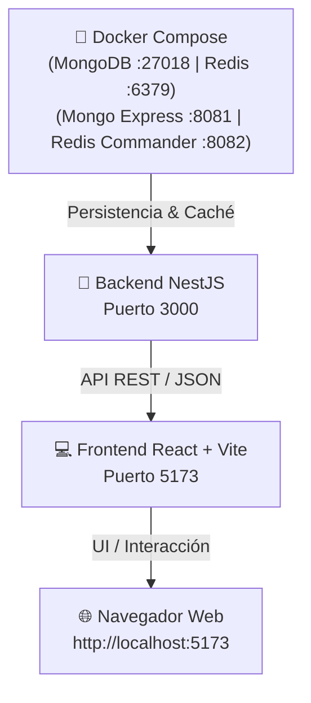

# ⚖️ WeightControl

> **Plataforma de Gestión de Datos y Validación de Certificación de Instrumentos de Pesaje**  
> Sistema integral para centralizar, validar, emitir alertas y garantizar la trazabilidad inalterable de instrumentos de pesaje (básculas comerciales, pesas patrón y dinamómetros) bajo el marco de metrología legal en Colombia.

---

## 📋 Tabla de Contenidos
1. [¿Qué es este Proyecto y para qué sirve?](#-qué-es-este-proyecto-y-para-qué-sirve)
2. [Contexto Maestro para Desarrolladores e IA (`CONTEXT.md`)](#-contexto-maestro-para-desarrolladores-e-ia-contextmd)
3. [Marco Normativo y Reglas de Negocio](#-marco-normativo-y-reglas-de-negocio)
4. [Estructura del Proyecto](#-estructura-del-proyecto)
5. [Tecnologías Utilizadas](#️-tecnologías-utilizadas)
6. [Requisitos Previos y Enlaces de Descarga](#-requisitos-previos-y-enlaces-de-descarga)
7. [Guía Paso a Paso para Iniciar el Proyecto](#-guía-paso-a-paso-para-iniciar-el-proyecto)
   - [Paso 1: Clonar el Repositorio](#paso-1-clonar-el-repositorio)
   - [Paso 2: Configurar y Ejecutar el Backend](#paso-2-configurar-y-ejecutar-el-backend)
   - [Paso 3: Configurar y Ejecutar el Frontend](#paso-3-configurar-y-ejecutar-el-frontend)
8. [Asistente de Commits Automáticos](#-asistente-de-commits-automáticos-commitps1-y-commitsh)
9. [Guía para el Grupo de Trabajo (Colaboradores)](#-guía-para-el-grupo-de-trabajo-colaboradores)
10. [Solución de Problemas Frecuentes (FAQ / Troubleshooting)](#-solución-de-problemas-frecuentes-faq--troubleshooting)

---

## 🎯 ¿Qué es este Proyecto y para qué sirve?

**WeightControl** resuelve la problemática de dispersión de información y la falta de sistemas unificados de inspección metrológica legal en Colombia. Proporciona una plataforma digital confiable donde entidades, técnicos, entes de control y ciudadanos pueden verificar y gestionar el estado metrológico de los instrumentos de pesaje.

### 👥 Actores del Sistema
* 🛠️ **Técnico Certificado:** Registra instrumentos, carga especificaciones técnicas, precintos SIMEL e informes de calibración.
* 🏛️ **Institución de Acreditación (ONAC / Laboratorios):** Valida y acredita calibraciones, precintos y certificaciones metrológicas.
* 🔍 **Instituciones Auditoras & SIC (Superintendencia de Industria y Comercio):** Fiscaliza el cumplimiento normativo, consulta pistas de auditoría inmutables e investiga irregularidades.
* 👤 **Administrador del Sistema:** Administra usuarios, roles, permisos y parámetros maestros (ej. umbrales de alerta).
* 🌐 **Ciudadano (Consulta Pública):** Consulta libre sin autenticación del estado de vigencia y certificación de un instrumento mediante su número de serie.

---

## 📌 Contexto Maestro para Desarrolladores e IA (`CONTEXT.md`)

En la raíz del repositorio se encuentra el archivo **[`CONTEXT.md`](./CONTEXT.md)**, el cual constituye la **fuente única de verdad** (*Single Source of Truth*) técnica y de negocio del sistema.

### ¿Para qué se utiliza `CONTEXT.md`?
1. **Instrucciones para Asistentes de IA (Claude, ChatGPT, Cursor, Copilot, Antigravity):** Define el rol de Arquitecto de Software Senior y las restricciones técnicas exactas que deben respetarse en cualquier generación de código, diseño de endpoints, modelos o pruebas.
2. **Modelo C4 del Sistema:** Detalla los niveles de Contexto (actores e interacciones), Contenedores (Frontend React, API Backend Node.js/NestJS, MongoDB, Redis) y Componentes del Backend.
3. **Reglas de Negocio Estrictas:** Ciclos de vida del instrumento (`Vigente`, `Por vencer`, `Vencido`), validaciones NTC 2031 (relación $Max/e$, precintos SIMEL, coherencia temporal) y auditoría inmutable.
4. **Patrones de Diseño GoF y Principios SOLID:** Guía obligatoria de arquitectura (Strategy para canales de notificación, Factory Method y Decorator para emisión de certificados digitales, Observer para eventos de estado metrológico, OCP, ISP y LSP).
5. **Modelos de Datos y Esquemas Mongoose:** Estructura oficial de las entidades (`Instrumentos`, `Usuarios`, `Calibraciones`, `Certificados`, `Trazabilidad_Eventos`).

> 💡 **Recomendación para el equipo:** Cada vez que comiences a desarrollar un nuevo módulo o le pidas a un asistente de IA que escriba código o diseñe funcionalidades para este proyecto, asegúrate de que tome como base [`CONTEXT.md`](./CONTEXT.md).

---

## ⚖️ Marco Normativo y Reglas de Negocio

El proyecto opera bajo la legislación y normas metrológicas colombianas:

* **NTC 2031:** Requisitos técnicos, metrológicos y de exactitud para instrumentos de pesaje de funcionamiento no automático (IPFNA) (*Clase I, Clase II, Clase III, Clase IIII*).
* **Decreto 1074 de 2015:** Control metrológico, calibraciones periódicas obligatorias, trazabilidad y precintos de seguridad ante la SIC / SIMEL.
* **ISO/IEC 27001 & Habeas Data:** Protección de datos personales, cifrado en tránsito (HTTPS) y en reposo (AES-256), y registros de auditoría inmutables.

```mermaid
stateDiagram-v2
    [*] --> Vigente: Calibración conforme registrada
    Vigente --> PorVencer: Faltan <= 30 días para calibración
    PorVencer --> Vencido: Fecha actual >= Fecha próxima calibración
    Vencido --> Vigente: Nueva calibración conforme cargada
    note right of Vencido: Bloqueo: No permite emisión de certificados de operación regular
```

---

## 📁 Estructura del Proyecto

```text
Weightcontrol/
├── CONTEXT.md                # 📌 CONTEXTO MAESTRO (Reglas, C4, SOLID/GoF, Normas, Mongoose)
├── docker-compose.yml        # 🐳 Orquestación de Contenedores (MongoDB, Redis, GUIs)
├── backend/                  # API REST construida con NestJS
│   ├── src/                  # Módulos, controladores, servicios y lógica de negocio
│   │   ├── app.controller.ts # Controlador principal
│   │   ├── app.service.ts    # Servicios principales
│   │   └── main.ts           # Punto de entrada con Logger de puerto integrado
│   ├── test/                 # Pruebas unitarias y End-to-End (e2e) con Vitest
│   ├── .env.example          # Plantilla de variables de entorno y conexión a DB
│   ├── package.json          # Dependencias y scripts del backend
│   └── tsconfig.json         # Configuración de TypeScript
├── frontend/                 # Aplicación web interactiva con React + Vite
│   ├── src/                  # Componentes, vistas y lógica de la interfaz
│   ├── index.html            # Plantilla HTML principal
│   ├── package.json          # Dependencias y scripts del frontend
│   └── vite.config.ts        # Configuración de Vite
├── .gitignore                # Reglas de exclusión para Git (ignora node_modules, dist, .env)
├── commit.ps1                # Asistente de commits para PowerShell (Windows)
├── commit.sh                 # Asistente de commits para Git Bash / Linux / macOS
└── README.md                 # Documentación completa del proyecto
```

---

## 🛠️ Tecnologías Utilizadas

| Capa / Módulo | Tecnologías Principales |
| :--- | :--- |
| **Backend (API)** | [NestJS](https://nestjs.com/) v12, [TypeScript](https://www.typescriptlang.org/), [Vitest](https://vitest.dev/), [Supertest](https://github.com/ladjs/supertest), [RxJS](https://rxjs.dev/) |
| **Frontend (UI)** | [React](https://react.dev/) v19, [Vite](https://vitejs.dev/) v8, [TypeScript](https://www.typescriptlang.org/), [ESLint](https://eslint.org/) |
| **Bases de Datos & Caché** | [MongoDB](https://www.mongodb.com/) v7.0 (NoSQL Documental), [Redis](https://redis.io/) v7 (Caché en memoria y sesiones) |
| **Contenedores & DevOps** | [Docker](https://www.docker.com/), [Docker Compose](https://docs.docker.com/compose/), [Mongo Express](https://github.com/mongo-express/mongo-express), [Redis Commander](https://joeferner.github.io/redis-commander/) |
| **Seguridad** | JWT (JSON Web Tokens), bcrypt (hashing), RBAC (Control de acceso basado en roles), AES-256 |
| **Entorno de Ejecución** | [Node.js](https://nodejs.org/) v18+ (Testeado y compatible con Node v22) |

---

## 📥 Requisitos Previos y Enlaces de Descarga

Si es la primera vez que vas a trabajar en el proyecto, descarga las herramientas desde sus sitios oficiales:

| Herramienta | Versión Recomendada | Enlace Oficial de Descarga | ¿Cómo verificar si ya lo tienes? |
| :--- | :--- | :--- | :--- |
| **Docker Desktop** | Última versión | 🔗 [Descargar Docker Desktop](https://www.docker.com/products/docker-desktop/) | `docker --version` y `docker compose version` |
| **Node.js** (incluye npm) | **v18 o superior** (LTS recomendada) | 🔗 [Descargar Node.js](https://nodejs.org/en/download) | `node -v` y `npm -v` |
| **Git** | Última versión disponible | 🔗 [Descargar Git para Windows/Mac/Linux](https://git-scm.com/downloads) | `git --version` |
| **Visual Studio Code** *(Opcional)* | Editor recomendado | 🔗 [Descargar VS Code](https://code.visualstudio.com/Download) | `code -v` |

---

## 🚀 Guía Paso a Paso para Iniciar el Proyecto

Para levantar el entorno completo sigue este flujo:



---

### Paso 1: Clonar el Repositorio

Abre tu terminal preferida (PowerShell, CMD o Git Bash) y clona el proyecto:

```bash
git clone https://github.com/Juan2007-sys/Weightcontrol.git
cd Weightcontrol
```

---

### Paso 2: Iniciar las Bases de Datos con Docker

En la raíz del proyecto, levanta los contenedores de MongoDB, Redis y las interfaces de administración visual:

```bash
docker compose up -d
```

> 💡 **Servicios disponibles en Docker:**
> | Servicio | Tipo | URL / Puerto Local | Credenciales por defecto |
> | :--- | :--- | :--- | :--- |
> | **MongoDB** | Base de Datos NoSQL | `localhost:27018` | Usuario: `admin` / Password: `adminpassword123` |
> | **Redis** | Caché en Memoria | `localhost:6379` | Sin contraseña por defecto |
> | **Mongo Express** | Panel Web MongoDB | **[http://localhost:8081](http://localhost:8081)** | Acceso libre en dev |
> | **Redis Commander** | Panel Web Redis | **[http://localhost:8082](http://localhost:8082)** | Acceso libre en dev |

Para detener los servicios cuando termines tu jornada de trabajo:
```bash
docker compose down
```

---

### Paso 3: Configurar y Ejecutar el Backend

Abre una terminal y entra a la carpeta `backend`:

```bash
# 1. Entrar a la carpeta backend
cd backend

# 2. Copiar la plantilla de variables de entorno (si no existe tu archivo .env)
# En PowerShell:
Copy-Item .env.example .env
# En Git Bash / Linux / Mac:
cp .env.example .env

# 3. Instalar las dependencias
npm install --legacy-peer-deps

# 4. Iniciar el servidor en modo desarrollo
npm run start:dev
```

> 🌐 **Resultado esperado**: Verás en la consola el logger de NestJS indicando:
> ```text
> [Nest] LOG [Bootstrap] 🚀 Application is running on: http://localhost:3000
> ```

#### Comandos del Backend:
| Comando | Función |
| :--- | :--- |
| `npm run start:dev` | Inicia el backend con recarga automática al guardar cambios |
| `npm run build` | Compila TypeScript a código JavaScript optimizado en `dist/` |
| `npm run start:prod` | Ejecuta la versión compilada de producción |
| `npm run test` | Ejecuta las pruebas unitarias con Vitest |
| `npm run test:e2e` | Ejecuta las pruebas End-to-End |

---

### Paso 4: Configurar y Ejecutar el Frontend

Abre una **segunda terminal** en la raíz del proyecto `Weightcontrol`:

```bash
# 1. Entrar a la carpeta frontend
cd frontend

# 2. Instalar las dependencias
npm install

# 3. Iniciar el servidor de desarrollo de Vite
npm run dev
```

> 💻 **Resultado esperado**: La terminal te mostrará la URL local:
> ```text
> VITE v8.x.x  ready in 200 ms
> ➜  Local:   http://localhost:5173/
> ```
> Abre tu navegador en **[http://localhost:5173](http://localhost:5173)** para interactuar con la aplicación.

#### Comandos del Frontend:
| Comando | Función |
| :--- | :--- |
| `npm run dev` | Inicia el servidor de desarrollo local con Hot Module Replacement (HMR) |
| `npm run build` | Compila y optimiza la aplicación para producción en `frontend/dist/` |
| `npm run preview` | Previsualiza localmente el build de producción |
| `npm run lint` | Ejecuta el análisis estático de código con ESLint |

---

## ⚡ Asistente de Commits Automáticos (`commit.ps1` y `commit.sh`)

Para estandarizar los commits del equipo según la convención **Conventional Commits** y evitar comandos largos de Git, dispones de scripts automatizados:

### 🌟 En Windows (PowerShell) - Recomendado:
```powershell
# Modo guiado interactivo (te hace preguntas paso a paso):
.\commit.ps1

# Modo rápido con mensaje directo:
.\commit.ps1 "feat(backend): agregar modulo de usuarios"
```

### 🐧 En Git Bash / Linux / macOS:
```bash
# Modo guiado:
./commit.sh

# Modo rápido:
./commit.sh "fix(frontend): corregir botón de guardado"
```

### ¿Qué hace el asistente?
1. Muestra el autor configurado y la rama actual (`main`, `feature/...`, etc.).
2. Identifica los archivos que modificaste (`git status -s`).
3. Agrega los cambios automáticamente al stage (`git add .`).
4. Te ayuda a clasificar el tipo de commit:
   - `feat`: Nueva funcionalidad.
   - `fix`: Corrección de error.
   - `docs`: Documentación o cambios en README.
   - `style`: Formateo, espaciados o CSS.
   - `refactor`: Mejora de código sin alterar funcionalidad.
   - `test`: Pruebas unitarias o e2e.
   - `chore`: Dependencias, configs o mantenimiento.
5. Permite ingresar el módulo/alcance opcional (ej. `backend`, `frontend`, `auth`).
6. Genera el commit estandarizado: `tipo(alcance): descripción`.
7. Te pregunta si deseas subirlo inmediatamente a GitHub (`git push`).

---

## 👥 Guía para el Grupo de Trabajo (Colaboradores)

Para que varios integrantes puedan colaborar en este repositorio sin conflictos:

### 1. El Administrador del Repositorio (Juan2007-sys):
1. Entra a [https://github.com/Juan2007-sys/Weightcontrol/settings/access](https://github.com/Juan2007-sys/Weightcontrol/settings/access).
2. Haz clic en **"Add people"** e ingresa el usuario o correo de cada compañero.

### 2. Cada Integrante del Equipo:
1. **Aceptar la invitación** recibida por correo electrónico o en GitHub.
2. Configurar su usuario de Git en su computadora:
   ```powershell
   git config --global user.name "Tu Nombre"
   git config --global user.email "tu_correo@ejemplo.com"
   ```
3. Clonar el repositorio y trabajar en su propia rama para evitar sobreescribir el trabajo de los demás:
   ```powershell
   # Crear y entrar a una rama propia para tu función:
   git checkout -b feature/mi-modulo

   # Realizar cambios y commitear con el script:
   .\commit.ps1
   ```

---

## ❓ Solución de Problemas Frecuentes (FAQ / Troubleshooting)

### 1. ¿Qué hacer si PowerShell dice: *"la ejecución de scripts está deshabilitada en este sistema"*?
Por seguridad, Windows restringe la ejecución de scripts `.ps1` por defecto. Habilítala para tu usuario ejecutando en PowerShell:
```powershell
Set-ExecutionPolicy -Scope CurrentUser -ExecutionPolicy RemoteSigned
```

### 2. ¿Qué hacer si la consola dice: *"'node'" o "'git'" no se reconoce como un comando*?
1. Verifica si completaste la instalación desde los enlaces de [Requisitos Previos](#-requisitos-previos-y-enlaces-de-descarga).
2. Cierra por completo la terminal o VS Code y vuelve a abrirlo.
3. Si persiste, revisa las variables de entorno de Windows y asegúrate de que `C:\Program Files\nodejs\` y `C:\Program Files\Git\cmd\` estén en tu variable `Path`.

### 3. ¿Qué hacer si `npm install` en el backend falla con errores de dependencias de pares (peer dependencies)?
Debes instalar usando el flag de dependencias heredadas:
```powershell
cd backend
npm install --legacy-peer-deps
```

### 4. ¿Qué hacer si al hacer `git push` sale el error: *"Updates were rejected because the remote contains work that you do not have locally"*?
Significa que otro compañero subió cambios antes que tú. Solo debes sincronizar tu repositorio con:
```powershell
git pull --rebase origin main
git push -u origin main
```

### 5. ¿Qué hacer si `git push` da error de permisos / acceso denegado?
1. Comprueba que el dueño del repositorio te haya agregado como **Colaborador**.
2. Verifica que hayas aceptado la invitación enviada a tu correo de GitHub.
3. Al hacer push, inicia sesión con tu cuenta de GitHub en la ventana emergente de Windows.
